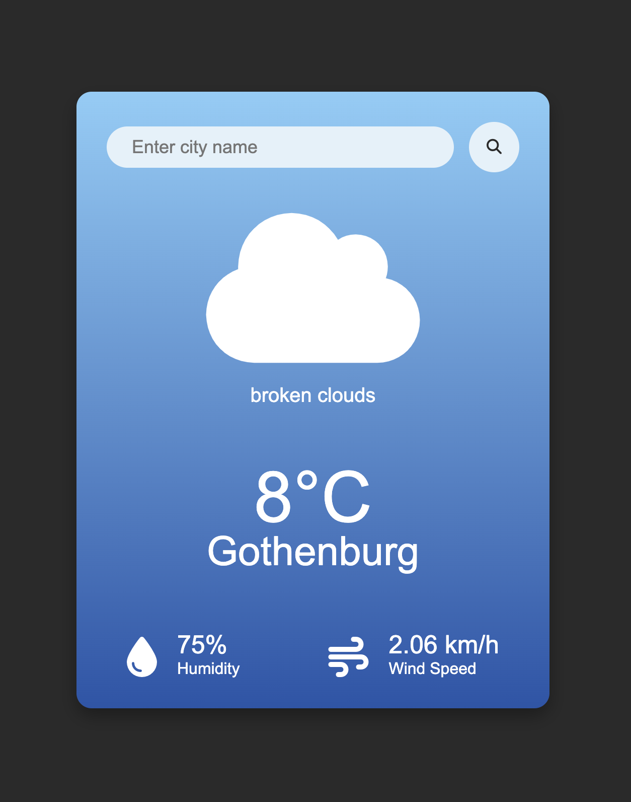

#  🌦️ Weather App
A simple and responsive **Weather Application** built with **HTML, CSS, and JavaScript** that displays real-time weather data for any city using the **OpenWeatherMap API**.

## Live Demo
[Add your GitHub Pages link here once deployed]
 
## 📸 Preview

## Features
✅ Search for any city around the world
✅ Display of:
 - Current temperature (°C)
 - City name
 - Weather condition (e.g., Clear, Rain, Clouds, Mist, Haze, etc.)
 - Humidity (%)
 - Wind speed (km/h)

✅ Dynamic weather icons that change based on the weather condition
✅ Default city: **Gothenburg**
✅ Error message when entering an invalid city name

